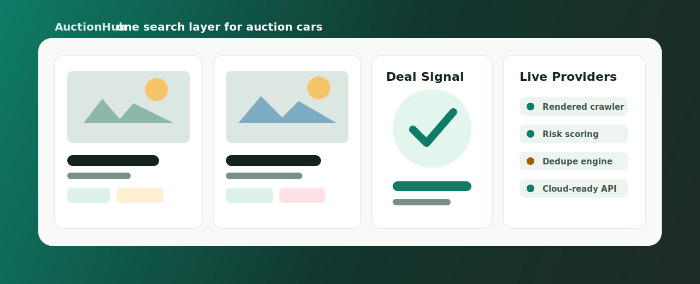
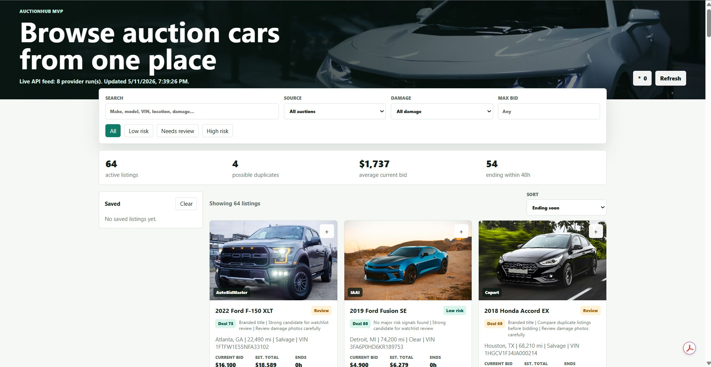
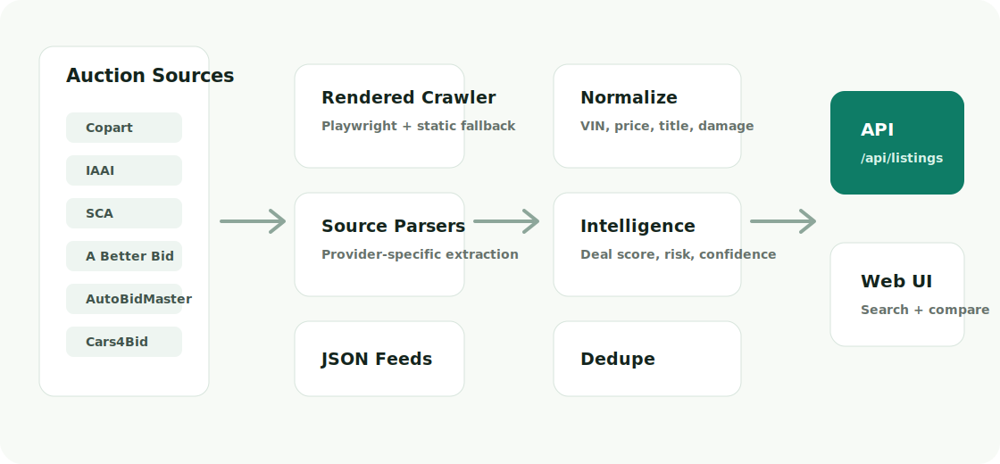

<p align="center">
  
</p>

# AuctionHub

**AuctionHub is a browsing-only car auction intelligence platform.** It pulls vehicle listings from multiple auction sources, normalizes them into one feed, deduplicates vehicles, scores risk and deal quality, estimates total cost, and sends users back to the original auction site to bid.




> Status: production-shaped MVP. The architecture is cloud-ready, but it still needs source hardening, persistence, monitoring, tests, and operational controls before real public launch.


## Why This Exists

Car auction buyers jump between Copart, IAAI, SCA, A Better Bid, AutoBidMaster, Cars4Bid, and broker mirrors. That creates a messy workflow: duplicate vehicles, inconsistent fees, scattered search, unclear damage risk, and no single view of what is worth watching.

AuctionHub aims to become the single workbench for auction buyers:

- Search auction cars across sources from one interface.
- Spot duplicate listings by VIN and normalized vehicle keys.
- Compare current bid, estimated fees, title type, damage, mileage, and location.
- Score listings by deal quality, data confidence, and buyer risk.
- Save interesting cars and jump to the original auction page to bid.

## Product Preview

<p align="center">
  
</p>

## Current Capabilities

| Area | What Works Today |
| --- | --- |
| Ingestion | Sample feeds, JSON feeds, static public-page crawling, rendered Playwright crawling |
| Providers | Configured for Copart, IAAI, SCA, A Better Bid, AutoBidMaster, Cars4Bid, Capital Auto Auction |
| Intelligence | Deal score, risk score, confidence score, risk reasons, buyer notes |
| Dedupe | VIN dedupe plus normalized make/model/year/location keys |
| API | Health, sources, listings, score filters, protected ingestion refresh |
| UI | Search, filters, save list, source filters, risk filters, score badges |
| Deployment | Docker, Docker Compose, GCP Cloud Run, AWS App Runner, Azure Container Apps, Kubernetes starters |

## Production Readiness

Short answer: **not fully production ready yet**. It is a strong production-oriented foundation, but not something I would launch to paying users tomorrow.

| Requirement | Status | Notes |
| --- | --- | --- |
| Cloud packaging | Ready | Docker and cloud starter configs exist |
| Rendered crawling | MVP ready | Playwright works locally and in the container base image |
| Source parsers | Partial | A Better Bid and AutoBidMaster are producing live rows; other sources need deeper parser work |
| Database | Not ready | Current storage is `data/listings.json`; production should use Postgres, Firestore, DynamoDB, or similar |
| Auth/admin | Not ready | Only ingestion token protection exists |
| Observability | Not ready | Needs logs, metrics, alerts, provider failure dashboards |
| Tests | Partial | Basic parser/intelligence tests exist; needs broader provider fixtures and API tests |
| Scheduler | Not ready | Needs Cloud Scheduler/EventBridge/Azure Jobs or worker queue |
| Rate limiting | Partial | Provider config has delays; needs global queue and backoff policies |
| Data quality | Partial | Intelligence fields exist; needs historical pricing and stronger validation |

## Quick Start

```powershell
npm install
npx playwright install chromium
npm run ingest
npm start
```

Open:

```text
http://localhost:4173
```

If port `4173` is already in use:

```powershell
$env:PORT=4174
npm start
```

Then open:

```text
http://localhost:4174
```

## Common Commands

```powershell
npm run ingest   # Refresh provider data into data/listings.json
npm start        # Start the API and web app
npm run check    # Syntax-check backend, ingestion, and frontend scripts
npm test         # Run parser and intelligence tests
```

## API

| Endpoint | Purpose |
| --- | --- |
| `GET /api/health` | Service status and listing count |
| `GET /api/sources` | Available source names |
| `GET /api/provider-health` | Provider ingestion status and normalized counts |
| `GET /api/listings` | Normalized listings |
| `GET /api/listings?q=honda` | Search listings |
| `GET /api/listings?minDealScore=70&minConfidence=60` | Filter by intelligence scores |
| `POST /api/ingest` | Protected ingestion refresh |

Protected ingestion requires:

```text
Authorization: Bearer <INGEST_TOKEN>
```

## Data Pipeline

```text
Auction sites / feeds
        |
        v
Static crawler / rendered Playwright crawler / JSON feed adapter
        |
        v
Source-specific parsers
        |
        v
Normalizer + validator
        |
        v
Dedupe + intelligence scoring
        |
        v
API + browser UI
```

## Project Structure

```text
.
├── app.js                         # Browser app
├── server.js                      # Node API/static server
├── scripts/ingest.js              # Ingestion entrypoint
├── src/ingestion/
│   ├── adapters/                  # sample/json/static/rendered crawlers
│   ├── intelligence.js            # deal/risk/confidence scoring
│   ├── normalizer.js              # canonical listing shape
│   ├── pipeline.js                # provider orchestration
│   ├── robots.js                  # robots parser utilities
│   └── sourceParsers.js           # provider-specific parser hooks
├── config/providers.json          # Provider configuration
├── data/seed-listings.json        # Safe sample data
├── docs/                          # Ingestion/deployment docs and visuals
├── deploy/                        # Cloud deployment starters
├── Dockerfile
└── compose.yaml
```

## Cloud Deployment

AuctionHub can run as a single container for MVP hosting.

```powershell
docker compose up --build
```

Cloud starter paths:

- GCP Cloud Run: `cloudbuild.yaml`
- AWS App Runner: `deploy/aws-apprunner.json`
- Azure Container Apps: `deploy/azure-container-app.yaml`
- Kubernetes: `deploy/k8s.yaml`

See [docs/DEPLOYMENT.md](docs/DEPLOYMENT.md).
See [docs/PRODUCTION_READINESS.md](docs/PRODUCTION_READINESS.md) for the launch checklist.

## Provider Integration

Provider configuration lives in [config/providers.json](config/providers.json).

Supported adapter types:

- `sample`: local development data
- `json-feed`: partner/vendor/exported JSON feed
- `website-crawler`: static public HTML fetch
- `rendered-crawler`: Playwright-rendered public page fetch

See [docs/INGESTION.md](docs/INGESTION.md).

## Roadmap To “Number One” Platform

- Source-specific parser hardening for all target auction sites.
- Real database with historical snapshots.
- Price history and comparable-sale intelligence.
- VIN decoder integration.
- Shipping estimator by pickup/dropoff ZIP.
- Fee calculator per provider and broker.
- Saved searches and alerts.
- User accounts and watchlists.
- Admin dashboard for provider health.
- Background worker queue for ingestion.
- CDN/image proxy and screenshot caching.
- Mobile app wrapper or native app after the web product proves usage.
  